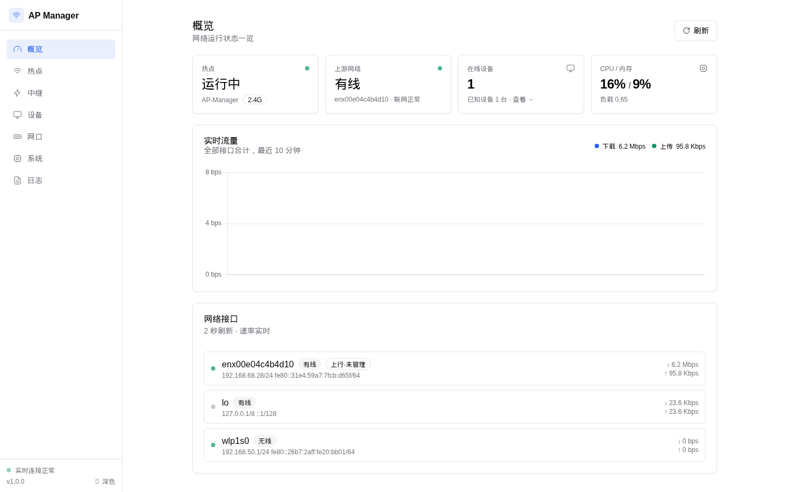
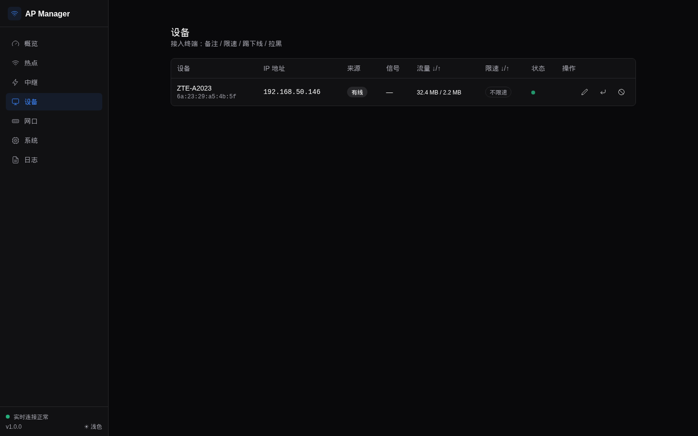
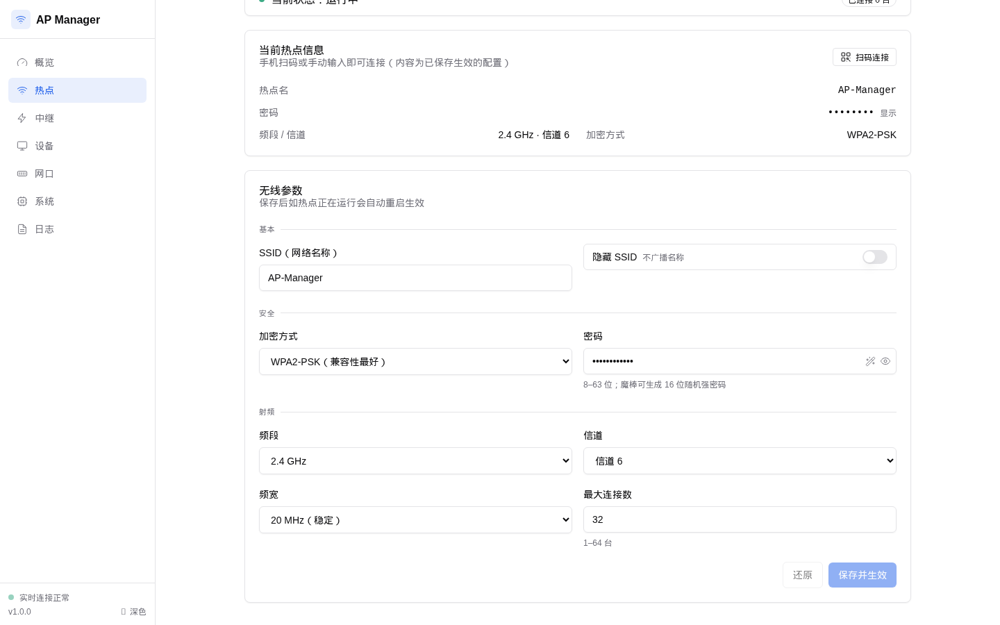

# AP Manager

**把一台 x86 Linux 小主机变成无线路由器。** Go 单二进制守护进程 + 内嵌 Web 管理界面，运行时零 Node/Python 依赖。

| 概览（亮色） | 设备（暗色） |
|---|---|
|  |  |
| **热点设置（含扫码连接）** | |
|  | |

## 功能特性

- **WiFi 热点（AP）**：hostapd 一键启停；WPA2 / WPA3 / 混合加密；2.4G/5G、信道（含 ACS 自动）、频宽、隐藏 SSID、最大连接数；硬件能力自动探测，不支持的选项直接禁用并说明原因
- **扫码连接**：服务端生成 WiFi 二维码（`/api/ap/qrcode.png`），手机扫一扫即连，改密码自动跟随
- **无线中继（STA）**：扫描周围 WiFi、保存多个上游按优先级自动切换、断线指数退避重连；与热点同卡互斥（见[已知限制](#已知限制)）
- **网口管理**：每个接口分配 WAN / LAN / 未使用角色；WAN 支持 DHCP / 静态 / PPPoE；LAN 网桥 + 独立子网 + DHCP 地址池；多网段隔离（家庭 / IoT / 访客）与客户端隔离
- **设备管理**：DHCP 租约 + 邻居表 + hostapd 在线列表聚合；备注别名、按设备上下行限速（tc HTB）、踢下线（无线去认证 / 有线等效阻断）、MAC 黑白名单
- **上游检测与切换**：多目标探测（国内 DNS 优先）、健康判定防抖、有线与 WiFi 中继自动切换
- **实时性**：SSE 推送全部状态（设备上下线、接口速率、上游健康、CPU/内存/温度），概览图表 Chart.js 惰性加载
- **安全应用机制**：网络拓扑变更前自动快照 → 应用 → 60 秒未确认自动回滚（`systemd-run` 兜底，守护进程被杀也能恢复），避免把自己锁在门外
- **系统**：管理密码（bcrypt + 首跑强制改密）、日志查看 + 子进程诊断面板、暗色模式、移动端适配

## 硬件与系统要求

| 项目 | 要求 |
|---|---|
| 架构 | x86_64（`make release` 可交叉编译 arm64） |
| 系统 | Debian 11+ / Ubuntu 20.04+（其他发行版install-deps.sh 会探测 apt/dnf/pacman/zypper） |
| 无线网卡 | 需支持 **AP 模式**（`iw list` 查看 `Supported interface modes`）；已实测 RTL8821CE |
| 内存/磁盘 | 128MB 内存即可；二进制 ~15MB |
| 权限 | root 运行（systemd 服务） |

## 快速开始

```bash
# 1. 安装系统依赖（hostapd dnsmasq nftables iw ethtool；自动探测包管理器）
sudo ./scripts/install-deps.sh

# 2. 构建并安装（二进制 → /usr/local/bin，systemd 单元 + 开机自启）
make build
sudo ./scripts/install.sh

# 3. 打开管理界面
#    默认监听 127.0.0.1:8080（改 /etc/apmanager/config.yaml 的 admin 段后 systemctl restart apmanager）
#    首跑初始密码打印在控制台，同时存于 /var/lib/apmanager/state.json.initial_password
#    （root-only；首次登录强制修改）
```

> **安全提醒**：默认 WiFi 密码 `apmanager123` 仅为出厂占位，部署后请立即在热点页修改；
> 管理界面如需局域网访问，改 `admin.bind: 0.0.0.0` 并确保 28080 端口不暴露到公网。

## 从源码构建

```bash
# 依赖：Go 1.22+、Tailwind CSS v3.4 独立 CLI（bin/tailwindcss，见 scripts/install-deps.sh）
make build    # = tailwind 生成 web/dist/app.css + go build -o bin/apmanager
make release  # 交叉编译：CGO_ENABLED=0 GOOS=linux GOARCH=amd64
make check    # go vet + embed 资源完整性
make dev      # 本机开发模式（假数据驱动 UI，不动系统，非 root 可跑）
```

前端为单页应用：Tailwind CSS（shadcn 风格设计 token，CSS 变量实现明暗双主题）+ 原生 Alpine.js + SSE，
JS 依赖（Alpine / Chart.js）全部本地化在 `web/vendor/`，**运行时不依赖任何 CDN**。

开发模式支持在非 Linux 平台跑 UI：`make dev` 后访问 127.0.0.1:8080（mock 数据）。

## 配置说明

配置文件：`/etc/apmanager/config.yaml`（首次启动自动生成）

```yaml
ap:
  enabled: true
  interface: wlp1s0
  ssid: Home
  password: "********"
  security: wpa2wpa3        # wpa2 | wpa3 | wpa2wpa3
  band: 2g                  # 2g | 5g
  channel: 6                # 0 = 自动（ACS）
  bandwidth: 20mhz          # 20mhz | 40mhz | 80mhz
  hidden: false
  max_clients: 32
  follow_upstream_channel: true   # 中继态把热点信道对齐上游
relay:
  enabled: false
  networks:                 # 已存上游，按 priority 升序自动切换
    - { ssid: UpA, password: "***", priority: 1 }
upstreams:
  priority: [eth-wan, wifi-relay]
  check: { interval_seconds: 5, fail_threshold: 3 }
ports:
  - { name: eth0, role: wan, wan: { mode: dhcp } }   # wan: dhcp | static | pppoe
  - { name: eth1, role: lan, bridge: br-lan }
lan:
  - name: home
    bridge: br-lan
    subnet: 192.168.50.1/24
    dhcp: { pool: [192.168.50.100, 192.168.50.200], lease_hours: 12 }
    isolation: false
zone_policy: { guest_to_lan: deny, iot_to_lan: deny, lan_to_lan: allow }
admin: { port: 8080, bind: 127.0.0.1 }
```

| 路径 | 内容 |
|---|---|
| `/etc/apmanager/config.yaml` | 期望配置（手改后 `systemctl restart apmanager` 生效） |
| `/var/lib/apmanager/state.json` | 运行状态（会话、别名、流量累计、初始密码文件） |
| `/var/lib/apmanager/run/` | 生成的 hostapd/dnsmasq/wpa_supplicant 配置与控制 socket |
| `/var/lib/apmanager/dnsmasq.leases` | DHCP 租约 |
| `/var/log/apmanager/app.log` | 应用日志（journald 同步） |

## 架构

```
Web UI (Tailwind + Alpine.js + SSE, go:embed)
  └─ HTTP API (net/http, REST + SSE)
      └─ Go 守护进程
          ├─ ap      hostapd 生命周期 / 配置渲染 / ctrl 控制接口
          ├─ relay   wpa_supplicant / 扫描 / 自动重连
          ├─ ethport 接口角色 / WAN/LAN / 桥 / 安全应用事务
          ├─ netrt   dnsmasq 渲染 / nftables 区域策略 / 上游探测
          ├─ devices 设备聚合 / tc 限速 / ACL
          ├─ system  会话 / 状态采样 / 日志环
          └─ priv    ★ 唯一特权层（exec / netlink / nft / tc，审计 + dry-run）
```

- 所有需要 root 的操作集中在 `internal/priv`，支持 `--dry-run` 演练
- 所有子进程（hostapd/dnsmasq/wpa_supplicant）由统一 Supervisor 托管：崩溃退避重启、stderr 诊断环、退出回收进程组
- nftables 只操作自建 `table inet apmanager`，绝不触碰系统其他规则
- 技术选型与设计细节见 [PLAN.md](PLAN.md)（含 RTL8821CE 实测记录）

## 已知限制

- **AP + STA 并发**：实测 RTL8821CE（rtw88 驱动）在第二接口拉起时返回 EBUSY，驱动强制互斥——中继与热点不能同开（管理器做了能力探测与明确提示）。需要真正的"中继 + 热点并存"请插一片 USB WiFi 网卡（推荐 RTL8821CU / MT7921AU 主控）
- **RTL8821CE 稳定性**：该卡 ASPM 省电有固件缺陷（`failed to get tx report`），`install-deps.sh` 会自动写入 `/etc/modprobe.d/rtw88.conf`（`disable_aspm=1`），重启生效
- **IPv6** 未支持（架构预留）
- **多 WAN 负载均衡**为实验特性，主备故障切换已可用
- 管理界面假设部署在**可信内网**；若上行口为公网直连，请务必配置防火墙限制管理端口

## 常见问题

<details>
<summary>WiFi 频繁掉线（RTL8821CE）</summary>

确认 `/etc/modprobe.d/rtw88.conf` 存在且内容为 `options rtw88_pci disable_aspm=1`，重启生效；
`dmesg | grep "tx report"` 不再增长即修复。
</details>

<details>
<summary>改了网口角色把自己断网了</summary>

安全应用机制会在 60 秒后自动回滚，等待即可；重启也会恢复到最近一次确认的配置。
</details>

<details>
<summary>设备列表来源显示"未知"</summary>

来源由 DHCP 租约 + hostapd 在线列表 + 邻居表聚合：三处都无法归类时显示"未知"（常见于静态 IP 且不在线的设备）。
</details>

## 文档

- [PLAN.md](PLAN.md) —— 完整设计文档（架构 / 功能清单 / 路线图 / 风险与对策）
- [NEEDUSER.md](NEEDUSER.md) —— 需要人工配合的实测清单

## License

[MIT](LICENSE)
